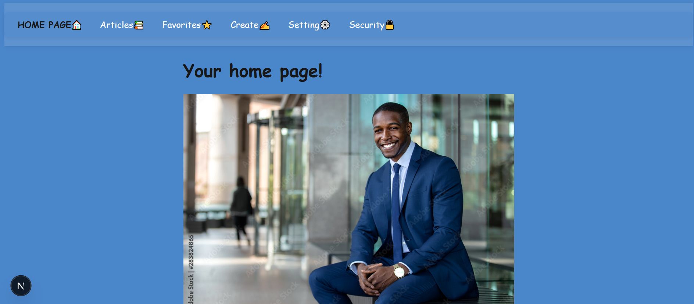
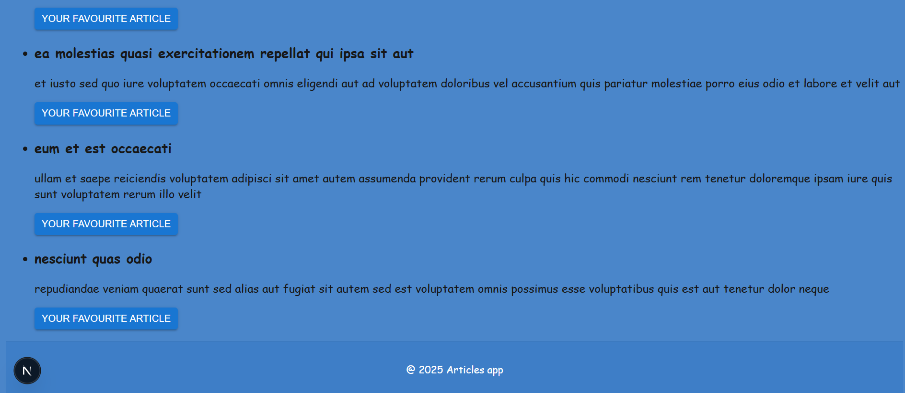
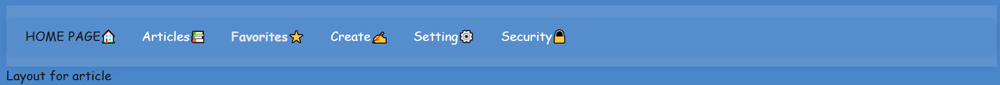
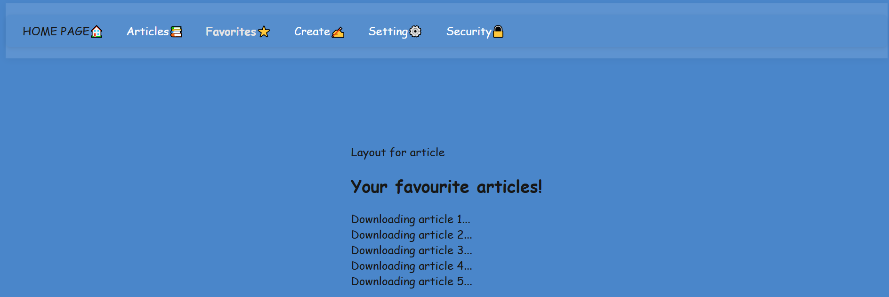
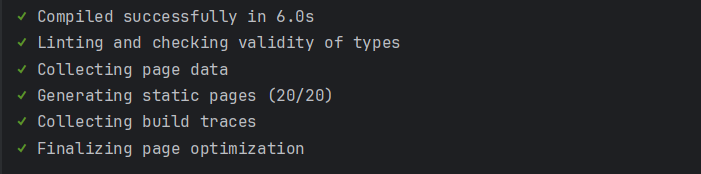
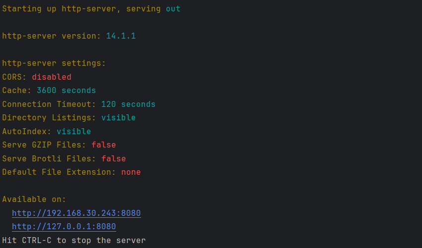
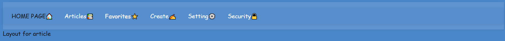
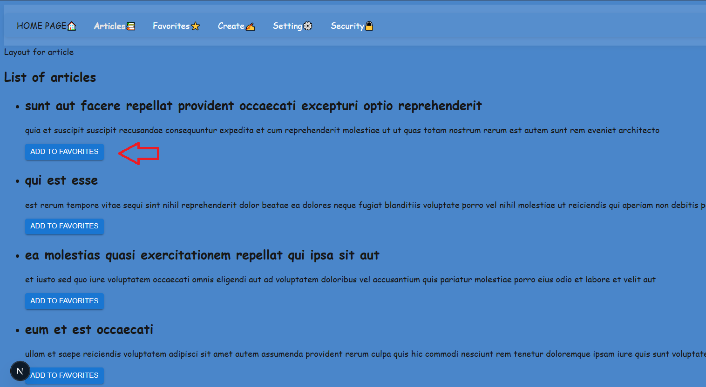

**Скріни до виконання лабораторної роботи №1**

**1. Додати підсвічування - готово**

**2. Вивести інфу зі статей в отримані дані**

**3. Сторінка з завантаженням статей**

**4. Сторінка з завантаженням улюблених статей**

**5. Білд апки динамічний**

**6. Білд апки статичний за допомогою npm http-server**

**7. Використання модульного scss файл для стилізації меню**

**8. Я вибрав юз компонентів з бібліотеки MUI у для статей та улюблених статей у вигляді кнопок**

